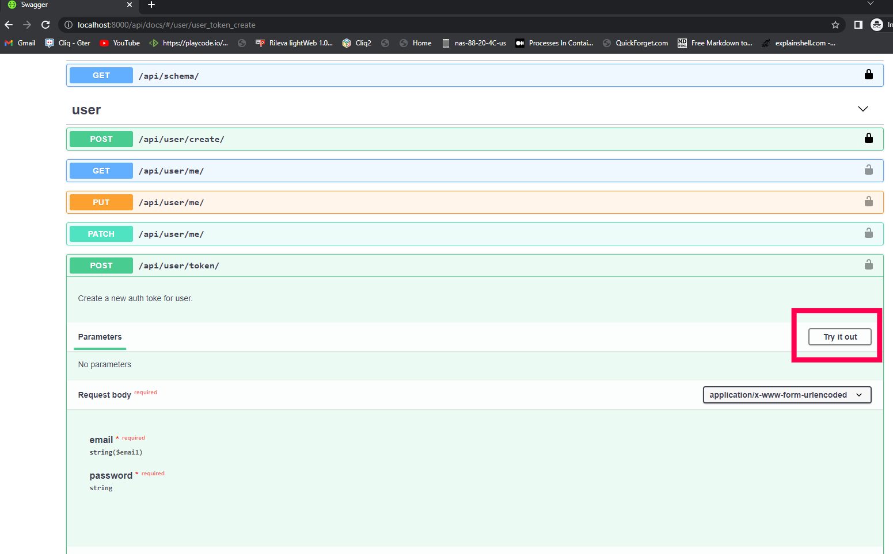
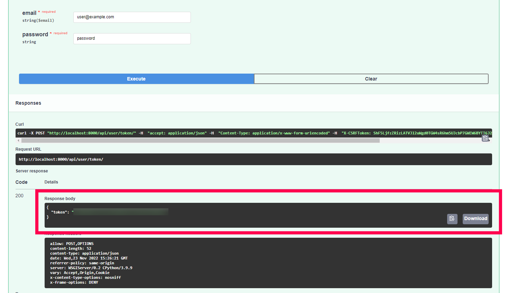
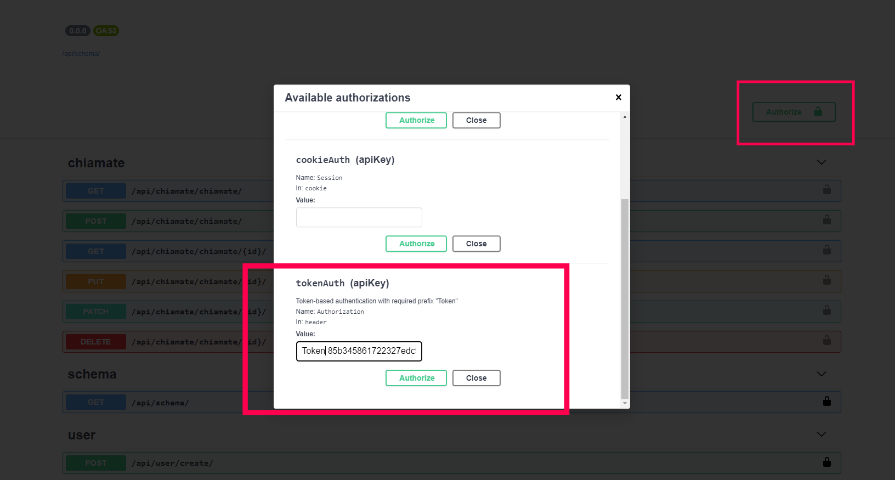

# General App

Web App consisting in a table that lists some requests to send to third-party service through Celery periodic task.
There's a login behind everything.

The task architecture is designed to block every other task unless the one that is being processed, it this task fails it is repeated till eventually a mail is sent to the administrator (defined in the `.env` file).
## Run tests
```bash
docker-compose run --rm app sh -c "python manage.py test"
```
Run tests and linting highlight
```bash
docker-compose run --rm app sh -c "python manage.py test && flake8" && docker-compose down
```
Create a super user (need to provide mail e pwd when prompted)
```bash
docker-compose run --rm app sh -c "python manage.py createsuperuser"
```

## Documentation of API
Put up the containers (`docker-compose up`) and go to `http://localhost:8000/api/docs/` to enter the swagger user interface.
In order to test the API login with a user created as mentioned above:

<center>

</center>

Then copy the Token:

<center>

</center>

And put it in the authorize tab in the right place:

<center>

</center>

## Adding model
When you add the model, before testing, you shoul make migrations:
```bash
docker-compose run --rm app sh -c "python manage.py makemigrations"
```

## Create new App
First of all create the app itself
```bash
docker-compose run --rm app sh -c "python manage.py startapp <app_name>"
```
then in `backend/app/app/settings.py` add the app under `INSTALLED_APPS` adn if it is the case rember to register the url and do the migrations.

## Frontend
Access to `http://localhost:3001/dashboard`, create a superuser if it does not exist and access with its credentials (mail and pwd)